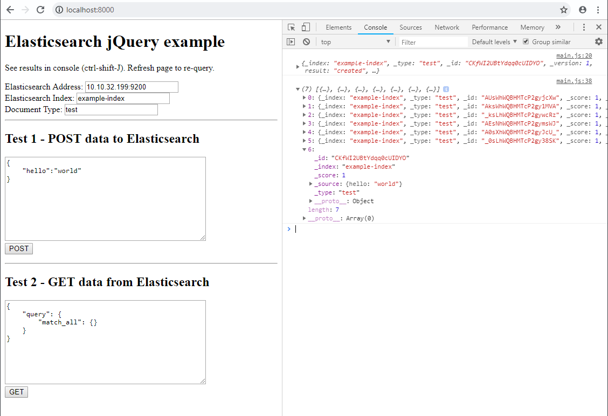

# Elasticsearch Jquery Example

Dead simple example to POST and GET data from Elasticsearch using jquery!

## Usage

1. Clone this repo
2. Run this puppy like `python -m http.server 8000`
3. Navigate browser to `localhost:8000` and open console
4. Fill out `Address`, `Index`, and `Document Type` for your elasticsearch instance
5. POST and GET documents from ES!

